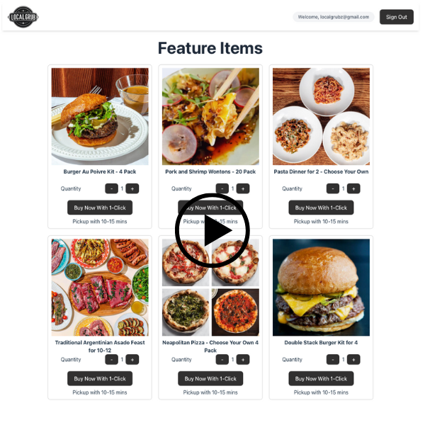
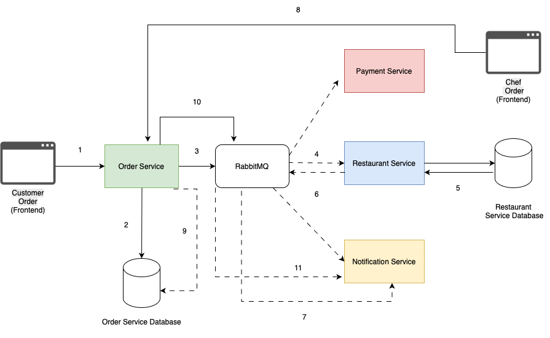

# LocalGrub 🍔
Food Delivery Platform

# About The Project
LocalGrub is a microservices-based food delivery platform that enables customers to order food, notifies restaurants, and manages payments—all through asynchronous, event-driven communication using RabbitMQ. The system is designed for resilience, scalability, and clear separation of concerns.

## Local Grub Happy Path & When A Microservice Goes Down Video
[](https://drive.google.com/file/d/1CAJFTE5mmKluq33BG0cP1vH9e5ZSUN98/view?usp=sharing)

# Tech Stack
- Frontend: React, TypeScript, Vite
- Backend: Node.js, Express, TypeScript
- Database: Firestore, PostgreSQL 
- Messaging: RabbitMQ (amqplib)
- Auth: Firebase Authentication
- Email: Nodemailer 
- Containerization: Docker, Docker Compose
  
# Architecture
Local Grub uses an event-driven architecture where services communicate asynchronously through RabbitMQ. This allows the system to be fault-tolerant and scalable.


### Data flow Diagram:

**1. Customer Order Placement**
The customer selects menu items and checks out using their credit card. The frontend application sends an API request to the Order Service, containing all necessary order and payment details.

**2. Order Storage**
The Order Service receives the request and stores the order in its database. The following customer and order information is saved:
uid, firstName, lastName, email, itemId, itemName, quantity, price, creditCardInfo, and createdAt.

**3. Event Emission: order_placed**
Acting as a producer, the Order Service publishes an order_placed event to RabbitMQ with a topic-based exchange. The event uses the routing key order_placed, and is routed to all bound queues listening for that topic.

**4.Event Consumption – Multiple Services**
The order_placed event is consumed by multiple microservices:
Payment Service: Charges the customer’s credit card.
Restaurant Service: Begins processing the order and checks inventory.
Notification Service: Sends a confirmation email to the customer acknowledging the order.

**5. Restaurant Inventory Check**
Upon consuming the order_placed message, the Restaurant Service queries its own database to verify ingredient availability for the ordered items. A boolean response indicates whether the items can be prepared.

**6. Event Emission: order_prepared**
If the ingredients are available, the Restaurant Service emits an order_prepared event to RabbitMQ. This informs the Order Service to update the order status to "Pending."

**7. Notification: Order in Preparation**
The Notification Service, subscribed to the order_prepared event, sends an email to the customer indicating that their order is being prepared and will be ready for pickup at an estimated time.

**8. Order Completion by Chef**
The restaurant chef accesses a dedicated Order Management Dashboard, which displays all incoming and in-progress orders. When the chef marks an order as "Completed", the frontend sends a POST request to the Order Service.

**9. Order Status Update**
The Order Service processes the request and updates the order’s status in its database to "Completed".

**10. Event Emission: order_ready**
After successfully updating the order status, the Order Service emits an order_ready event to RabbitMQ, signaling that the order is ready for pickup.

**11. Final Notification to Customer**
The Notification Service, listening for the order_ready event, sends a final email to the customer notifying them that their order is ready for pickup.

# Getting Started

### Prerequisites
- [Node.js](https://nodejs.org/)
- [Docker](https://www.docker.com/)
- [Docker Compose](https://docs.docker.com/compose/)
- [Firebase Project](https://firebase.google.com/) (for Firestore/Auth)

### 1. Clone the repository
```bash
git clone https://github.com/yourusername/localgrub-app.git
cd localgrub-app
```

### 2. Set up environment variables
Copy .env.example to .env in each service and fill in the required values (RabbitMQ URL, Firebase credentials, etc.).
You do NOT need to run npm install manually for each service if you use Docker Compose!

## Environment Variables Setup
This project uses environment variables to securely manage sensitive configuration (such as API keys, database URLs, and service credentials) for each microservice and the frontend.
You must create your own .env files for each service before running the project.

#### Why use environment variables?
- Security: Keeps secrets and credentials out of source code.
- Flexibility: Allows different settings for development, testing, and production.
- Separation of concerns: Each service only has access to the variables it needs.

#### Frontend (client/.env.example)
Purpose:
Stores public configuration for the React frontend, such as API URLs and Firebase client keys.

What to do:
~~~
Copy client/.env.example to client/.env
~~~

Fill in the required values
Typical variables:
VITE_API_URL — The base URL for your backend API (e.g., http://localhost:3005)
VITE_FIREBASE_API_KEY, VITE_FIREBASE_AUTH_DOMAIN, etc. — Your Firebase project’s public config

Where to get Firebase config:
Firebase Console > Project Settings > General > Your apps > Firebase SDK snippet

#### Order Service (server/order-service/.env.example)
Purpose:
Stores sensitive backend configuration for the Order Service, such as RabbitMQ connection, Firebase admin credentials, and service ports.

What to do:
```
Copy server/order-service/.env.example to server/order-service/.env
```

Fill in the required values
Typical variables:
PORT — Port for the Order Service (e.g., 3005)
RABBITMQ_URL — RabbitMQ connection string (e.g., amqp://rabbitmq:5672)
FIREBASE_PROJECT_ID, FIREBASE_PRIVATE_KEY, FIREBASE_CLIENT_EMAIL — Firebase Admin SDK credentials
Where to get Firebase Admin credentials:
Firebase Console > Project Settings > Service Accounts > Generate new private key

Where to get RabbitMQ URL:
If using Docker Compose, use the default: amqp://rabbitmq:5672
Otherwise, see your RabbitMQ server documentation: RabbitMQ Connection Strings

#### Payment Service (server/payment-service/.env.example)
Purpose:
Stores sensitive backend configuration for the Payment Service, such as RabbitMQ connection and payment gateway keys.

What to do:
```
Copy server/payment-service/.env.example to server/payment-service/.env
```
Fill in the required values
Typical variables:
PORT — Port for the Payment Service (e.g., 3002)
RABBITMQ_URL — RabbitMQ connection string
PAYMENT_GATEWAY_KEY — Your payment processor’s API key (e.g., Stripe, PayPal)
Where to get payment gateway keys:
Stripe API Keys
PayPal Developer

#### Restaurant Service (server/restaurant-service/.env.example)
Purpose:
Stores sensitive backend configuration for the Restaurant Service, such as RabbitMQ connection and Postgres database URL.
What to do:
```
Copy server/restaurant-service/.env.example to server/restaurant-service/.env
```
Fill in the required values
Typical variables:
PORT — Port for the Restaurant Service (e.g., 3003)
RABBITMQ_URL — RabbitMQ connection string
POSTGRES_URL — Postgres database connection string
Where to get Postgres connection string:
Postgres Connection Strings

#### Notification Service (server/notification-service/.env.example)
Purpose:
Stores sensitive backend configuration for the Notification Service, such as RabbitMQ connection and email provider credentials.
What to do:
```
Copy server/notification-service/.env.example to server/notification-service/.env
```
Fill in the required values
Typical variables:
PORT — Port for the Notification Service (e.g., 3001)
RABBITMQ_URL — RabbitMQ connection string
EMAIL_USER, EMAIL_PASS — Email provider credentials (e.g., Gmail, SendGrid)
Where to get email provider credentials:
Gmail App Passwords
SendGrid API Keys


# Contributing
- Coming Soon...

